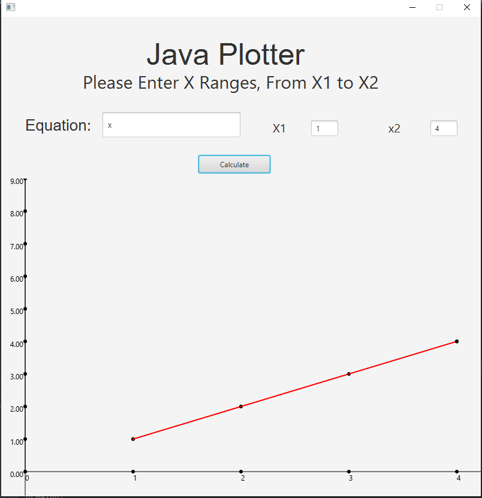

# JPlotter
- a simple tool for plot your functions in graphs using min x and max, and it draws and calculate y values
- Graph is built from scratch using Javafx canvas
## Screenshots

## Dependencies
- mxparser
- junit
- JavaFX
